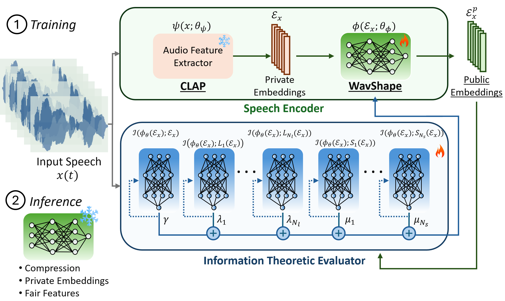

# WavShape: Information-Theoretic Speech Representation Learning for Fair and Privacy-Aware Audio Processing

WavShape is an open-source framework implementing an information-theoretic approach to speech representation learning. It optimizes speech embeddings for fairness and privacy while preserving task-relevant information. By leveraging mutual information (MI) estimation through the Donsker-Varadhan formulation, WavShape systematically filters sensitive attributes such as speaker identity, accent, and demographic details, ensuring robust and unbiased downstream tasks (e.g., automatic speech recognition, emotion detection).

## Overview

The increasing reliance on deep learning for speech processing raises concerns regarding privacy and bias. WavShape addresses these challenges by:
- **Optimizing for Fairness & Privacy:** Removing sensitive attributes from speech embeddings.
- **Preserving Task-Relevant Information:** Retaining essential acoustic and linguistic cues.
- **Efficient Compression:** Reducing speech representation dimensionality without significant performance loss.

Inspired by information theory and self-supervised learning models (e.g., Whisper, wav2vec 2.0), WavShape combines speech encoders with a trainable MI-based projection layer that filters out unwanted information.

## Repository Structure

```
WavShape/
├── README.md                  # This file.
├── docs/                      # Documentation.
├── src/                       # Source code.
│   ├── models/                # Encoder, MI evaluator, etc.
│   ├── data/                  # Data handling scripts.
│   ├── training/              # Training routines.
│   ├── evaluation/            # Evaluation scripts.
│   └── utils/                 # Helper functions.
├── experiments/               # Experiment configurations, logs.
├── requirements.txt           # Python dependencies.
└── LICENSE                    # License file.
```

## Key Features

- **Fair & Privacy-Aware Speech Encoding**
- **Task-Oriented Embedding Retention**
- **Mutual Information Optimization**
- **Modular & Extensible Architecture**
- **Comprehensive Experimental Validation**

## Installation

### Prerequisites
- **Python 3.8+**
- **PyTorch 1.9+**
- **CUDA-enabled GPU** (recommended for training)
- Install dependencies using:

```bash
git clone https://github.com/wavshapeinterspeech25/wavshape.git
cd wavshape
pip install -r requirements.txt
```

## Data Preparation

Supported datasets:
- **Mozilla Common Voice (MCV):** Fairness evaluation in ASR.
- **Google Speech Commands (GSC):** Privacy-aware keyword spotting.
- **MusicNet:** Structured spectral learning in music recordings.

Prepare datasets as specified in `src/data/`.

## Usage

### Training the Model

```bash
python src/training/train_wavshape.py --config experiments/config.yaml
```

- **Encoder Training:** Updates weights to maximize MI with task-relevant features while suppressing sensitive attributes.
- **MI Estimation:** Iteratively refines MI estimates.

### Evaluating the Model

```bash
python src/evaluation/evaluate.py --model_path experiments/best_model.pth --dataset common_voice
```

- **t-SNE Visualizations**
- **AUROC Scores**
- **Classification Accuracy Before & After Encoding**

### Visualization

```bash
python src/evaluation/visualize_tsne.py --embeddings experiments/embeddings.npy
```

## Architecture Details

WavShape consists of two main components:

### 1. Speech Encoder
- **Feature Extraction Layer (Non-trainable):** Converts raw audio into an intermediate representation using Whisper/wav2vec 2.0.
- **Information-Theoretic Embedding Layer (Trainable):** Maps extracted features to a lower-dimensional space, ensuring fairness and privacy.

### 2. Information-Theoretic Evaluator
- Estimates MI using the Donsker-Varadhan formulation.
- Guides the encoder training to balance utility and privacy.

## Experimental Setup & Results

### Datasets
- **Mozilla Common Voice (MCV):** Task label = age, sensitive attributes = gender, accent.
- **Google Speech Commands (GSC):** Task label = general command category, filtered labels = granular commands.
- **MusicNet:** Task label = instrument labels, filtered metadata = composer, movement.

### Models
- Feature extraction with **Whisper**.
- Classification with **lightweight neural networks**.

### Evaluation Metrics
- **t-SNE** for high-dimensional visualization.
- **AUROC** to quantify sensitive attribute leakage.
- **Classification accuracy** comparison.

### Results
- **Privacy & Fairness:** MI between embeddings and sensitive attributes reduced from **0.6208 to 0.2671** while retaining task MI at **0.3791**.
- **Efficient Compression:** Maintaining up to **95.5% accuracy** even with reduced dimensionality.
- **Bias Mitigation:** Sensitive attribute AUROC reduced to **0.47**, demonstrating fairness improvements.

## Citation

If you use WavShape in your research, please cite:

```
@inproceedings{wavshape2025,
  title={WavShape: Information-Theoretic Speech Representation Learning for Fair and Privacy-Aware Audio Processing},
  author={TBD},
  booktitle={Interspeech 2025},
  year={2025}
}
```

## License

This project is licensed under the MIT License. See the [LICENSE](LICENSE) file for details.

## Contact

For questions or contributions, please contact:
- [FirstNameA LastNameA](mailto:first@university.edu)
- [FirstNameB LastNameB](mailto:second@companyA.com)
- [FirstNameC LastNameC](mailto:third@companyB.ai)


